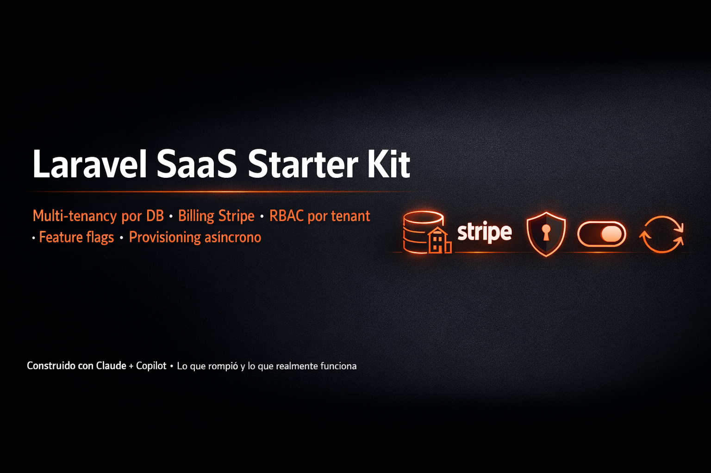

<div align="center">

# Plinth - Multi-tenant SaaS Engine

Framework SaaS multi-tenant profesional para Laravel con aislamiento de datos de grado industrial y arquitectura modular orientada a operaciones.



[](https://www.php.net)
[](https://laravel.com)
[](https://livewire.laravel.com)
[](https://fluxui.dev)
[](https://tenancyforlaravel.com)

</div>

## Filosofía Operativa
Plinth no es solo un boilerplate; es un motor diseñado para ser gestionado a las 3:00 AM. Se prioriza la **visibilidad operativa** y la **segmentación funcional** sobre la simplicidad superficial.

- **Central (Landlord):** Panel de control operativo con señales críticas (tenants en riesgo, fallos de jobs, auditoría global).
- **Tenant (Instancias):** Aplicaciones totalmente aisladas con base de datos, storage y cache independientes.
- **Shared:** Núcleo de DTOs, contratos e infraestructura compartida para mantener la integridad del sistema.

## Estado de Implementación

### Central Administration (Operativo)
- **Dashboard Operativo:** Basado en señales (Alertas 24h, Inquilinos en riesgo, Feed de actividad real).
- **Tenant Provisioning:** Onboarding guiado, gestión de dominios personalizados, backups/snapshots y sistema de impersonación.
- **Billing Segmentado:** 
  - *Subscriptions:* Gestión del ciclo de vida y planes activos.
  - *Plans:* Configuración de límites soft/hard (usuarios, storage) y features.
  - *Invoices:* Historial financiero con visualización de proformas.
- **Affiliate Engine:** Gestión de socios comerciales y rastreo automático de conversiones.
- **Webhook System:** Configuración de endpoints y auditoría de entregas con capacidad de reintento.
- **Security:** Auditoría centralizada (Audit Trail) y obligatoriedad de 2FA para administradores.

### Tenant Context (MVP)
- **Aislamiento Total:** Conexiones de BD dinámicas, storage por UUID y cache segmentada por tags.
- **Auth:** Guard separado para el entorno tenant.
- **Self-Service:** Gestión de perfil y configuración básica del espacio de trabajo.
- **Job Tenancy:** Middleware automático para restaurar el contexto del inquilino en colas de trabajo.

## Stack Tecnológico
- **Core:** Laravel 11/12+ & PHP 8.3/8.4.
- **Frontend:** Livewire + Flux UI (Componentes reactivos profesionales).
- **Tenancy:** Stancl Tenancy v3 (Database-per-tenant architecture).
- **Database:** PostgreSQL (Optimizado para esquemas dinámicos).
- **Observabilidad:** Laravel Horizon (Queues), Laravel Pulse (Salud) y Audit Logs nativos.
- **Testing:** Pest (Tests de integración y aislamiento de datos).

## Estructura de Módulos (DDD-ish)
```text
app/
  ├── Central/                # Lógica del Landlord
  │   ├── BillingModule/      # (Plans, Subscriptions, Invoices)
  │   ├── AffiliateModule/    # (Partners, Conversions)
  │   ├── PartnerWebhookModule/
  │   └── ...
  ├── Tenant/                 # Lógica de las instancias
  │   ├── IdentityContext/
  │   ├── OperationsContext/
  │   └── ...
  └── Shared/                 # Contratos y DTOs comunes
```

## Guía de Inicio Rápido

### Requisitos
- PHP 8.3+ | Composer 2+ | Node 20+ | PostgreSQL 16+

### Instalación Automática
```bash
composer setup
```
*Este comando gestiona dependencias, variables de entorno, migraciones centrales y builds de frontend.*

### Entorno de Desarrollo
```bash
composer dev
```
*Inicia el servidor, Vite, Horizon para colas y Pail para logs en una sola terminal.*

### Calidad de Código
```bash
composer test      # Pest Suite
composer lint      # Pint Format
```

## Seguridad y Aislamiento
- **Data Leaks:** Prevención por diseño mediante `InitializeTenancyByDomain` y middlewares de restricción.
- **Storage:** Los archivos de inquilinos se almacenan en `storage/app/tenants/{uuid}/`, inaccesibles desde el dominio central.
- **Jobs:** El `tenant_id` se inyecta en el payload del job para garantizar que el worker siempre opere en la base de datos correcta.

---
*Plinth es un producto de ingeniería diseñado para escalar. Simple, modular y predecible.*
